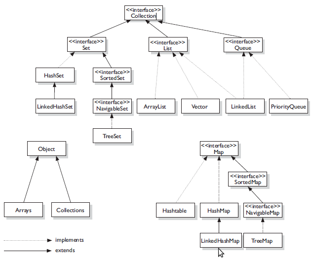

# 기본 개념
## OOP (Object Oriented Programming) 란?
SW 프로그램 개발 시 유사 속성 및 기능을 모아 '객체' 를 만들고, 객체들을 유기적으로 프로그래밍하는 방법론을 말한다. OOP의 크게 아래와 같이 4가지 특성으로 설명할 수 있다.
* 추상화 (Abstraction)
* 상속성 (Inheritance)
* 캡슐화 (Encapsulation)
* 다형성 (Polymorphism)

## 클래스와 객체
- 클래스 : 객체를 만들기 위한 필드 및 메서드가 정의되어 있는 청사진
- 객체 : 구현해야 할 대상
- 인스턴스 : 구현된 대상 (객체가 좀 더 큰의미로 인스턴스를 객체라고 하는 것은 틀린말은 아니다)

## 추상화
어떤 실체로부터 공통적인 속성이나 관심있는 속성을 한 곳에 모으는 것

## 상속성
어느 클래스가 다른 클래스의 필드 및 메서드를 물려받을 수 있는 성질

**상속의 효과**
- 기존 클래스 재사용을 통한 자식 클래스의 빠른 구현
- 중복 코드 감소
- 유지 보수의 편리성
- 객체 다형성 구현 가능

## 캡슐화
유사한 역할의 필드와 메서드를 하나의 클래스로 묶고, 그 중 일부를 외부에서 사용하지 못하도록 은닉화하는 것
**은닉화**
접근제어자(Access modifier) 를 사용하여 객체의 필드 및 메서드를을 외부에서 사용하는 것을 제한하는 것을 말한다.
(자바 접근제어자 : public, protected, default, private)

## 다형성
여러가지 형태를 가질 수 있는 성질. 자바에서는 인터페이스와 추상클래스로 다형성을 구현하였다.

### Interface vs Abstract class
&nbsp;|인터페이스 | 추상클래스
-|-|-
선언방법|interface |abstract
상속방법|implements|extends
다중상속|가능|불가
속성|상수 필드 추상 메서드 디폴트 메서드(Java8)|추상 메서드를 포함한 클래스

### Overriding vs Overloading
Overriding | Overloading
-|-
상위클래스에 정의된 메서드를 하위 클래스에서 재정의하는 기법|매개변수의 타입 및 개수가 다른 같은 이름의 메서드를 여러개 정의할 수 있는 기법
Run-time에 method binding 결정|Compile-time에 method binding 결정

## 객체지향 설계 5원칙 SOLID

 (출처 : https://sjh836.tistory.com/159)

## 자바의 특징
* **객체 지향 언어이다.** 객체 지향 언어의 4가지 특성을 완벽하게 지원한다.
* **이식성이 높은 언어이다.** 자바 언어로 개발된 프로그램은 JRE (자바 실행 환경)이 설치된 모든 운영체제에서 소스 코드 수정 없이 실행 가능하다.
* **메모리를 자동 관리한다.** 개발자가 직접 메모리를 할당/해제할 필요 없이 JVM이 Garbage Collector를 실행시켜 알아서 메모리를 관리해준다.
* **멀티쓰레드를 쉽게 구현할 수 있다.** 스레드 생성 및 제어와 관련된 라이브러리 API를 제공하고 있기 때문에 실행되는 운영체제에 상관없이 멀티 스레드를 쉽게 구현할 수 있다.
* **동적 로딩 (Dynamic Loading)을 지원한다.** 프로그램이 실행될 때 모든 객체를 로딩하지 않고, 객체가 필요한 시점에 클래스를 동적으로 로딩하여 생성한다.
* **함수적 스타일 코딩을 지원한다.** 함수적 프로그래밍을 지원하기 위해 Java8부터 람다식을 지원한다.
* **속도가 느리다.** 프로그램은 개발자가 자바 언어로 구현한 자바(.java)파일은 컴파일을 통해 바이트코드 (.class)로 변환된 상태로 존재하며, 프로그램이 실행될 때 JVM이 바이트코드를 기계어로 번역하고 실행한다. 따라서 C, C++에 비해 속도가 느리나 JIT 컴파일러와 같은 기술이 적용되면서 점점 그 격차가 줄어들고 있다.
  **※ JIT (Just-In-Time)** 컴파일러는 JRE 내부에 존재하며, 프로그램의 동일한 코드를 매번 해석하지 않고 실행할 때 컴파일하면서 해당 코드를 캐싱한다. 이후에 변경된 부분만 컴파일하고 나머지는 캐싱된 코드를 재사용함으로써 인터프리터 속도를 향상시킨다.

# JVM
## JVM 동작 원리 및 기본 개념
* [JVM 동작원리 및 기본개념](https://steady-snail.tistory.com/67)
* [JVM 동작원리 및 기본개념2](https://gbsb.tistory.com/2)

## 메모리
* [메모리 구조](https://hoonmaro.tistory.com/19)
* [메모리 관리](https://yaboong.github.io/java/2018/05/26/java-memory-management/)

## GC (Garbage Collector)
* [GC](https://d2.naver.com/helloworld/1329)
* [GC2](https://mirinae312.github.io/develop/2018/06/04/jvm_gc.html)
* [GC & Reference](https://d2.naver.com/helloworld/329631)

# 자료구조

* [자료구조](https://joooootopia.tistory.com/13)
* [ArrayList vs LinkedList](https://www.holaxprogramming.com/2014/02/12/java-list-interface/)
* [Enumeration vs Iterator](https://happystory.tistory.com/33)
* [HashMap 알고리즘](https://d2.naver.com/helloworld/831311)
* [String vs StringBuilder vs StringBuffer](https://cjh5414.github.io/why-StringBuffer-and-StringBuilder-are-better-than-String/)

# Throwable
Error|Exception
-|-
시스템레벨에서 발생하는 오류|개발자 구현한 로직에서 발생하는 오류
시스템레벨의 심각한 오류이기 때문에 시스템에 변화를 주어 문제를 처리해야 하는 경우가 일반적|개발자 로직을 추가하여 에러 처리
OutOfMemory|IOException, RuntimeException

&nbsp;|Checked exception|Unchecked exception
-|-|-
처리여부|반드시 예외 처리 해야 함|명시적으로 예외 처리를 강제하지는 않음
확인시점|Compile time|Run time
예외발생 시 트랜잭션 처리|roll-back 하지 않음|roll-back 함
대표예외|Exception 하위 클래스 중 Runtime exception을 제외한 모든 exception - IOException - SQLException|RuntimeException의 하위 클래스 - NullPointerException - IllegalArgumentException - IndexOutOfBoundException

출처.http://www.nextree.co.kr/p3239/
  

출처.https://stackoverflow.com/questions/912334/differences-between-exception-and-error